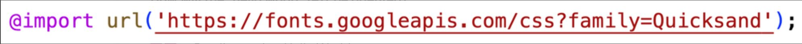
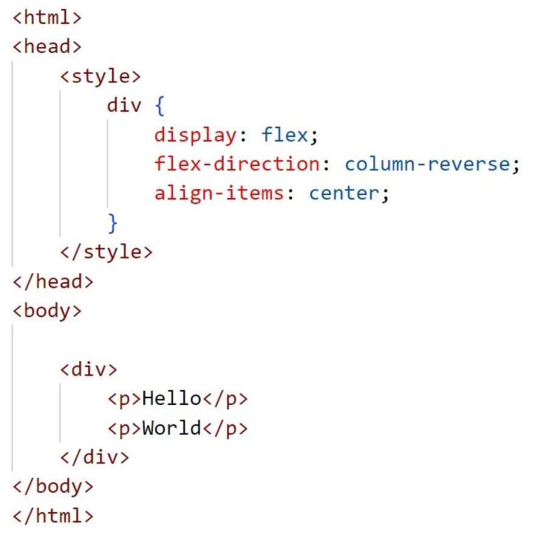

Deploying Files 
./deployFiles.sh -k "~/Desktop/CS 260/production.pem" -h talkaday.click -s startup

### NOTES FOR MIDTERM

## GIT NOTES 
* git clone https://github.com/webprogramming260/startup-example.git

* If we run the fetch Git command, you will get the latest information about the changes on GitHub without actually changing your local repository. We then run the status Git command to see the differences between the clones and see that we are missing a commit. You can pull it down using the pull Git command. You can also use the Git functionality in VS Code to view the status and sync up your repository.

* This is the pattern that you want to make a reflexive part of your development process.

* Pull the repository's latest changes from GitHub (git pull)
* Make changes to the code
* Commit the changes (git commit)
* Push the changes to GitHub (git push)

## Console Commands
* echo - Output the parameters of the command
* cd - Change directory
* mkdir - Make directory
* rmdir - Remove directory
* rm - Remove file(s)
* mv - Move file(s)
* cp - Copy files
* ls - List files
* curl - Command line client URL browser
* grep - Regular expression search
* find - Find files
* top - View running processes with CPU and memory usage
* df - View disk statistics
* cat - Output the contents of a file
* less - Interactively output the contents of a file
* wc - Count the words in a file
* ps - View the currently running processes
* kill - Kill a currently running process
* sudo - Execute a command as a super user (admin)
* ssh - Create a secure shell on a remote computer
* scp - Securely copy files to a remote computer
* history - Show the history of commands
* ping - Check if a website is up
* tracert - Trace the connections to a website
* dig - Show the DNS information for a domain
* man - Look up a command in the manual

* | - Take the output from the command on the left and pipe, or pass, it to the command on the right
* '>' - Redirect output to a file. Overwrites the file if it exists
* '>>' - Redirect output to a file. Appends if the file exists
* CTRL-R - Use type ahead to find previous commands
* CTRL-C - Kill the currently running command

## HTML Notes
element	meaning
* html-	The page container
* head-	Header information
* title-	Title of the page
* meta-	Metadata for the page such as character set or viewport settings
* script- JavaScript reference. Either a external reference, or inline
* include- External content reference
* body- The entire content body of the page
* header- Header of the main content
* footer- Footer of the main content
* nav- Navigational inputs
* main- Main content of the page
* section- A section of the main content
* aside- Aside content from the main content
* div-	A block division of content
* span- An inline span of content
* h<1-9> - Text heading. From h1, the highest level, down to h9, the lowest level
* p- A paragraph of text
* b- Bring attention
* table- Table
* tr- Table row
* th- Table header
* td- Table data
* ol,ul- Ordered or unordered list
* li- List item
* a- Anchor the text to a hyperlink
* img- Graphical image reference
* dialog- Interactive component such as a confirmation
* form- A collection of user input
* input- User input field
* audio- Audio content
* video- Video content
* svg- Scalable vector graphic content
* iframe- Inline frame of another HTML page
* '&'	&amp;
* '<'	&lt;
* '>'	&gt;
* ' " '	&quot;
* " ' "	&apos;
* 😀 "&#128512";

Element Meaning Example
</img>

Promise and Async/Await
 
</img>
</img>

Type	Meaning
* text-	Single line textual value
* password-	Obscured password
* email-	Email address
* tel-	Telephone number
* url-	URL address
* number-	Numerical value
* checkbox-	Inclusive selection
* radio-	Exclusive selection
* range-	Range limited number
* date-	Year, month, day
* datetime-local-	Date and time
* month-	Year, month
* week-	Week of year
* color-	Color
* file-	Local file
* submit-	button to trigger form submission

Attribute	Meaning
* name-	The name of the input. This is submitted as the name of the input if used in a form
* disabled-	Disables the ability for the user to interact with the input
* value-	The initial value of the input
* required-	Signifies that a value is required in order to be valid

## CSS Notes
Combinator	Meaning	Example	Description
* Descendant-	A list of descendants	body section	Any section that is a descendant of a body
* Child-	A list of direct children	section > p	Any p that is a direct child of a section
* General sibling-	A list of siblings	div ~ p	Any p that has a div sibling
* Adjacent sibling-	A list of adjacent sibling	div + p	Any p that has an adjacent div sibling

## JavaScript Notes
Log 
* console.log('hello');
*   // OUTPUT: hello
* console.log('hello %s', 'world');
*   // OUTPUT: hello world
* console.log('%c JavaScript Demo', 'font-size:1.5em; color:green;');
*   // OUTPUT: JavaScript Demo //in large green text
Timers
* console.time('demo time');
*   // ... some code that takes a long time.
* console.timeEnd('demo time');
*   // OUTPUT: demo time: 9762.74 ms
Count 
* console.count('a');
*   // OUTPUT: a: 1
* console.count('a');
*   // OUTPUT: a: 2
* console.count('b');
*   // OUTPUT: b: 1

Declaring Variables
Type	     Meaning
* Null-	     The type of a variable that has not been assigned a value.
* Undefined- The type of a variable that has not been defined.
* Boolean-	 true or false.
* Number-	 A 64-bit signed number.
* BigInt-	 A number of arbitrary magnitude.
* String-	 A textual sequence of characters.
* Symbol-	 A unique value.

Type	                    Use	                                                                       Example
* Object-	A collection of properties represented by name-value pairs. Values can be of any type.	{a:3, b:'fish'}
* Function-	An object that has the ability to be called.	                                        function a() {}
* Date-	    Calendar dates and times.	                                                            new Date('1995-12-17')
* Array-	    An ordered sequence of any type.	                                                    [3, 'fish']
* Map-	    A collection of key-value pairs that support efficient lookups.	                        new Map()
* JSON-	    A lightweight data-interchange format used to share information across programs.	    {"a":3, "b":"fish"}

Strings
Function	        Meaning
* length-	        The number of characters in the string
* indexOf()-	        The starting index of a given substring
* split()-	        Split the string into an array on the given delimiter string
* startsWith()-      True if the string has a given prefix
* endsWith()-	    True if the string has a given suffix
* toLowerCase()-	    Converts all characters to lowercase

Functions 
Function	Meaning	Example
* push-	    Add an item to the end of the array	a.push(4)
* pop-	    Remove an item from the end of the array	x = a.pop()
* slice-	Return a sub-array	a.slice(1,-1)
* sort-	    Run a function to sort an array in place	a.sort((a,b) => b-a)
* values-	Creates an iterator for use with a for of loop	for (i of a.values()) {...}
* find-	    Find the first item satisfied by a test function	a.find(i => i < 2)
* forEach-	Run a function on each array item	a.forEach(console.log)
* reduce-	Run a function to reduce each array item to a single item	a.reduce((a, c) => a + c)
* map-	    Run a function to map an array to a new array	a.map(i => i+i)
* filter-	Run a function to remove items	a.filter(i => i%2)
* every-	Run a function to test if all items match	a.every(i => i < 3)
* some-	    Run a function to test if any items match	a.some(i => 1 < 1)

## In Class Review Notes
* You can use this CSS to load fonts from Google
</img>

* ANSWER: TRUE
* How will the hello world text be oriented 
</img>

* ANSWER: two lines with the first line saying World and the second saying Hello
* the CSS Property padding: 
</img>

* ANSWER: Puts space around the content of selected elements 
* Executing the following will out: 
</img>

* ANSWER: 4
* In HTML what does div do 
* ANSWER: Creates a division element 
* What is the order of CSS box model starting from outside going in
* ANSWER: margin, border, padding, content
* What does the following code output 
</img>

* ANSWER: ['rat', 'fish']
* What does the following code output 
</img>

* ANSWER: cow:rat:fish
* what does the following code output
</img>

* ANSWER: ['a1', 'a2', 'a3']
* What does the following code do
</img>

* ANSWER: adds mouseover event listener to a p element 
* What is the HTML tag for an unordered list
* ANSWER: < ul >
* which of the following is not valid JavaScript function 
* ANSWER: function f(x) = {} (examples of good JS: const f = (x) => {}, function f(x) {}, const f = function (x) {} )
* which of the following is not a valid way to include JavaScript in HTML 
* ANSWER: <!-- <javascript>1+1</javascript> (examples of good JS: , "<script src='main.js' />, 
)
* Which of the following is a valid JavaScript object
* ANSWER: {n:1}
* What does the DOM textContent property do
* sets the child text for an element 
* Which HTML will create a valid hyperlink 
* ANSWER: a href='https://c.com'>x</a>
* Using CSS how would you turn only the BYU text blue
</img>

* ANSWER: div.header { color: blue; }
* Which of the following is valid JSON
* ANSWER: {"x":3}
* The following console command makes a script executable 
* ANSWER: chmod +x deploy.sh
* which of the following is a DNS subdomain 
* ANSWER: c260.cs.byu.edu
* To point to another DNS record you should use the following DNS record type
* ANSWER: CNAME 
* What will be the following output 
</img>

* ANSWER: burger fries taco shake noodles
* what will be the following output 
</img>

* ANSWER: A D B

